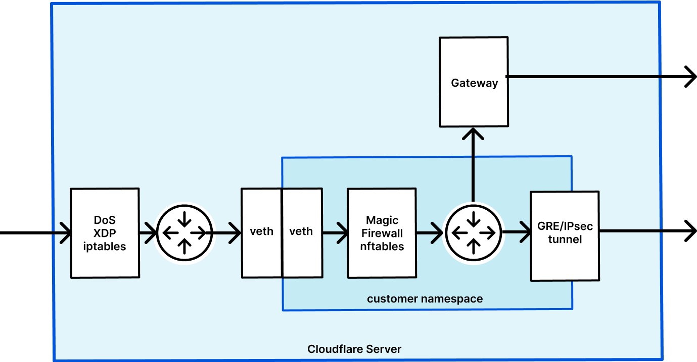
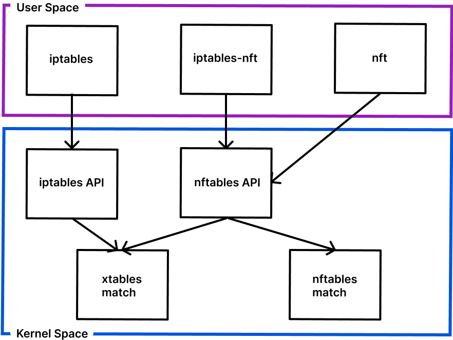

# 我们如何在Magic Firewall中使用eBPF打造可编程的网络包过滤能力
<p align='right'>2021 年 12 月 6 日 克里斯 · J · 阿尔杰斯</p>


作为全球最强大的网络服务提供商之一的Cloudflare，我们日复一日地积极保护用户服务免受各种各样的网络攻击。对于使用Magic Transit服务的用户来说，它提供的DDoS保护功能可以检测和阻止攻击行为。而我们的[Magic Firewall](https://www.cloudflare.com/magic-firewall/)服务允许数据包级别的自定义规则，使用户能够淘汰防火墙硬件设备，直接在Cloudflare网络服务上就可以屏蔽恶意流量。

当前网络攻击类型和复杂性不断发展，如最近[针对VoIP服务](http://blog.cloudflare.com/update-on-voip-attacks/)的DDoS和反射[攻击](http://blog.cloudflare.com/attacks-on-voip-providers/)就表明了这一点，这些攻击针对的是会话初始协议（SIP）协议。对抗这些攻击需要将数据包过滤的极限，已经提升到传统防火墙所能做到的范围之外了。我们通过采用先进一流的技术，并结合新的方式将它们整合起来，使Magic Firewall服务成为一种速度极快、完全可编程的防火墙，甚至可以抵御目前最复杂的网络攻击。

## 魔力防火墙
我们的[Magic Firewall](http://blog.cloudflare.com/introducing-magic-firewall/)服务是一个基于Linux nftables技术的分布式无状态网络数据包防火墙。它运行在Cloudflare全球每个数据中心的每台服务器上。为了提供更好的隔离性和灵活性，每个客户的nftables规则都配置在他们自己的Linux网络命名空间内。



这张图展示了使用Magic Transit服务时网络数据包的生命周期，Magic Transit内置了Magic Firewall服务。首先，数据包刚进入服务器时，DDoS保护开始生效，它会尽可能早地阻止攻击行为。接下来，数据包被路由到客户特定的网络命名空间，此时nftables规则被作用到数据包上。然后，数据包通过GRE隧道被路由回原始路径。Magic Firewall用户可以使用灵活的[Wirefilter语法](https://github.com/cloudflare/wirefilter)，只要通过[单一API接口](https://developers.cloudflare.com/magic-firewall)就能构建防火墙声明策略。同时，也可以通过Cloudflare仪表板，使用友好的UI拖拽元素来配置规则。

Magic Firewall服务为匹配各种网络数据包参数，提供了一种非常强大的语法，但它也仅限于nftables提供的匹配能力。虽然这对大多数的使用场景来说已是绰绰有余，但它没有提供足够的灵活性，来实现我们想要的高级数据包解析和内容匹配能力。因此，我们需要更多的力量。

## 你好eBPF，Nftables这厢有礼了

为了满足Linux网络需求，想要增加更多的功能时，扩展型伯克利包过滤技术（[eBPF](https://ebpf.io/)）是你的不二选择。有了eBPF，你可以插入数据包处理程序并 *在内核空间* 执行，这样能让你拥有熟悉的编程范式带来的灵活性，同时兼具内核执行的高效性。Cloudflare[热爱eBPF](http://blog.cloudflare.com/tag/ebpf/)，这项技术在打造我们自身产品期间，起到了变革作用。因而我们希望找到一种方法，通过eBPF来扩展我们在Magic Firewall中对nftables的使用场景。这意味着能够在nftables表内和链内，使用eBPF程序来实现规则匹配。这样做能保留我们现有的基础设施和代码，并进一步扩展它，从而就能实现“鱼和熊掌兼得”。

如果nftables能够原生利用eBPF的话，这就会变得简单多了。。。唉，我们不得不继续我们的探索，目前已经知道iptables可以跟eBPF集成，让我们从这里开始入手。例如，可以使用iptables和一个持久化eBPF程序来丢弃数据包，命令如下：

```bash
iptables -A INPUT -m bpf --object-pinned /sys/fs/bpf/match -j DROP
```

这条线索帮助我们走上了正确的道路。Iptables使用[xt_bpf](https://git.kernel.org/pub/scm/linux/kernel/git/torvalds/linux.git/tree/net/netfilter/xt_bpf.c#n60)扩展模块来对接一个eBPF程序。这个扩展模块使用 **BPF_PROG_TYPE_SOCKET_FILTER** eBPF程序类型，它允许我们在套接字缓冲区（socket buffer）加载数据包信息并根据我们的代码返回值。

既然我们知道iptables可以使用eBPF，为什么不直接利用它呢？Magic Firewall目前使用的还是nftables，它灵活的语法和可编程的接口，对于我们的用户场景是一个不错的选择。因此，我们需要找到一种方法，实现基于nftables使用 **xt_bpf** 扩展模块。



这张[示意图](https://developers.redhat.com/blog/2020/08/18/iptables-the-two-variants-and-their-relationship-with-nftables#using_iptables_nft) 有助于解释iptables、nftables和内核之间的关系。nftables API可以被iptables和nft用户空间程序使用，也可以配置使用xtables模块（包含xt_bpf）和一般nftables模块进行匹配。

这意味着，只要使用正确的API调用（发送netlink/netfilter消息），我们就可以将xt_bpf匹配嵌入到nftables规则中。为了做到这一点，我们需要了解应该发送哪些netfilter信息。通过使用strace、Wireshark等工具，尤其当我们使用[源码](https://github.com/torvalds/linux/blob/master/net/netfilter/xt_bpf.c)，就能够构建一个消息体，可以针对特定的nftables表和链，附加一个eBPF规则。

```bash
NFTA_RULE_TABLE table
NFTA_RULE_CHAIN chain
NFTA_RULE_EXPRESSIONS | NFTA_MATCH_NAME
	    NFTA_LIST_ELEM | NLA_F_NESTED
	    NFTA_EXPR_NAME "match"
		        NLA_F_NESTED | NFTA_EXPR_DATA
		        NFTA_MATCH_NAME "bpf"
		        NFTA_MATCH_REV 1
		        NFTA_MATCH_INFO ebpf_bytes
```

为netlink/netfilter消息结构体添加eBPF匹配后，应该看起来像上面的例子。当然，这个消息需要正确嵌入，同时当有一个匹配需求时，需要包含一个条件型步骤，就像一次判决。下一步是对`ebpf_bytes`格式进行解码，如下例所示：

```C
struct xt_bpf_info_v1 {
	__u16 mode;
	__u16 bpf_program_num_elem;
	__s32 fd;
	union {
		struct sock_filter bpf_program[XT_BPF_MAX_NUM_INSTR];
		char path[XT_BPF_PATH_MAX];
	};
};
```

`ebpf_bytes`字节格式的定义，可以在内核头文件中定义的结构体[xt_bpf_info_v1](https://git.netfilter.org/iptables/tree/include/linux/netfilter/xt_bpf.h#n27)中找到。上面的代码例子显示了该结构体的相关部分。

xt_bpf模块既支持原始字节码，也支持持久化到某个文件路径的ebpf程序。接下来的内容就是我们整合ebpf程序和nftables的技术详情。

有了这些信息，我们就可以通过编写代码创建netlink信息，并正确地序列化任何相关的数据字段。这只是第一步，我们还在研究如何将其整合到合适的工具中去，取代发送自定义netfilter消息的方式。

## 整合eBPF

现在我们需要构建一个eBPF程序，并将其加载到一个现有的nftables表和链中。刚开始使用eBPF可能会有点难度，比如应该使用哪种程序类型、如何编译和加载我们的eBPF程序。我们通过做了一些探索和研究，开启了我们的旅程。

首先，我们构建了一个示例程序来进行尝试。

```C
SEC("socket")
int filter(struct __sk_buff *skb) {
  /* get header */
  struct iphdr iph;
  if (bpf_skb_load_bytes(skb, 0, &iph, sizeof(iph))) {
    return BPF_DROP;
  }

  /* read last 5 bytes in payload of udp */
  __u16 pkt_len = bswap_16(iph.tot_len);
  char data[5];
  if (bpf_skb_load_bytes(skb, pkt_len - sizeof(data), &data, sizeof(data))) {
    return BPF_DROP;
  }

  /* only packets with the magic word at the end of the payload are allowed */
  const char SECRET_TOKEN[5] = "xyzzy";
  for (int i = 0; i < sizeof(SECRET_TOKEN); i++) {
    if (SECRET_TOKEN[i] != data[i]) {
      return BPF_DROP;
    }
  }

  return BPF_OK;
}
```

上面摘录的是是一个eBPF程序例子，它只接受在网络请求末端有一串“魔法”字符的数据包。我们需要检查数据包的总长度，来找到开始搜索的位置。为了表述更清楚，这个例子省略了错误检查和头文件引用的相关代码。

一旦我们编写好了程序，下一步就是把它整合到我们的工具中。我们尝试了一些技术来加载这个程序，比如BCC、libbpf，甚至我们还自研了一个自定义加载器。最后，我们最终使用了[cilium的ebpf库](https://github.com/cilium/ebpf/)，因为我们的控制面程序使用的也是Golang语言，而cilium提供的ebpf库使得生成、嵌入和加载eBPF程序变得容易很多。

```bash
# nft list ruleset
table ip mfw {
	chain input {
		#match bpf pinned /sys/fs/bpf/mfw/match drop
	}
}
```

一旦程序被编译和持久化，我们就可以使用`netlink`命令将匹配的内容添加到nftables中。通过列出规则集，就能显示刚刚添加的匹配内容。这真是不可思议，现在我们能在Magic Firewall规则集内部署定制的C程序，实现了先进的匹配能力了!

## 更多魔力

随着eBPF整合到我们的工具包里，Magic Firewall服务变成了一种能保护你的网络免受坏人侵害的，更灵活和强大的方式。我们现在能够更深入地研究网络数据包，实现比nftables自身提供的更复杂的匹配逻辑。由于我们的防火墙服务，是作为软件运行在所有Cloudflare服务器上的，因此可以实现快速迭代和功能更新。

这个项目的成果之一是实现SIP保护能力，当然，它目前还处于beta测试阶段。这仅仅是个开始，目前我们正在探索使用eBPF进行协议验证、高级字段匹配、网络请求分析、支持更大的IP列表集。

欢迎任何人给我们提供帮助! 如果你有其他使用场景和想法，请与我们的客户团队沟通讨论。如果你觉得这项技术很有趣，就来[加入我们的团队吧](https://www.cloudflare.com/careers/)!